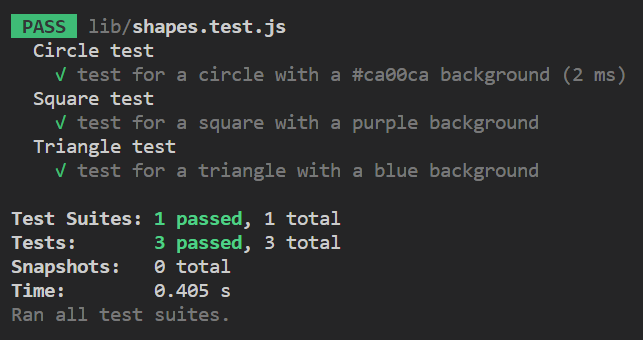

# Module 10 Challenge: SVG Logo Maker

## Table of Contents

- [Module 10 Challenge: SVG Logo Maker](#module-10-challenge-svg-logo-maker)
  - [Table of Contents](#table-of-contents)
  - [Project Description](#project-description)
  - [Installation](#installation)
  - [Usage](#usage)
  - [Contributing](#contributing)
  - [Tests](#tests)
  - [Questions](#questions)

## Project Description

This application is a Scalable Vector Graphic generator that allows web developers to create simple logo graphics through the terminal.

I created this project to learn more about back-end development and how developers can achieve functionality without the user of an user interface. This project also allowed me to learn about unit testing through the use of the "Jest" library.

A user can use this application by simply running the code in a terminal and answering the given prompts.

## Installation

First, begin by cloning this repository onto a directory of your choice. Then, open the file in a coding editor and open the terminal. Once the termial is open, ensure that you are in the correct directory.

## Usage

After installation, run the code in the terminal by first using 'node index.js'. Answer the given prompts until a message 'successfully created' is displayed. You will find the generated svg file displayed under the index.js file within the repository.

## Contributing

Thank you for your interest in my project; however, I will not be accepting contibutors for my project.

## Tests

Test this code by running the comming 'npm run test'.

## Questions

Contact information for any questions through these links:

[GitHub](https://github.com/undefined)

[Email: rikuchoy@gmail.com](mailto:rikuchoy@gmail.com)
